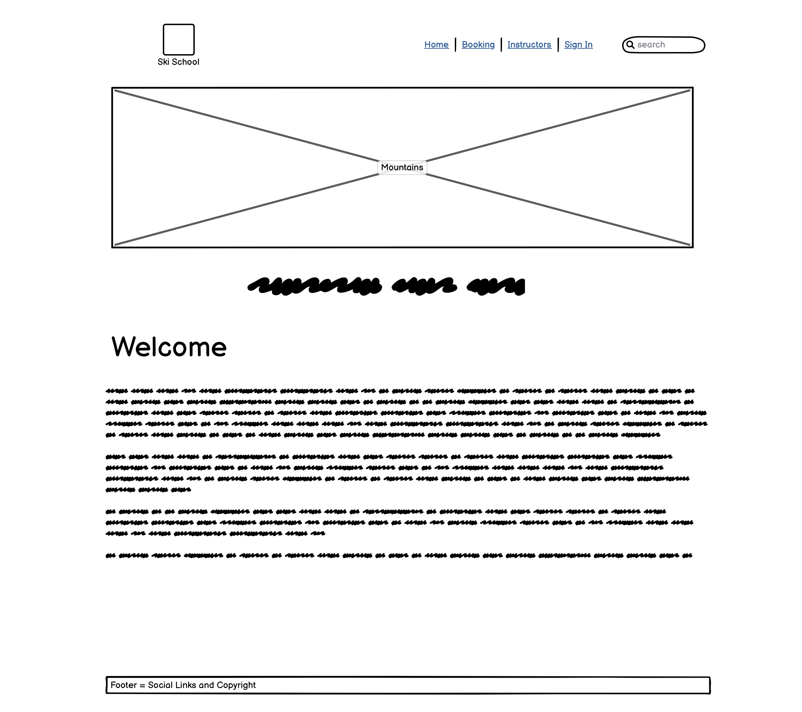
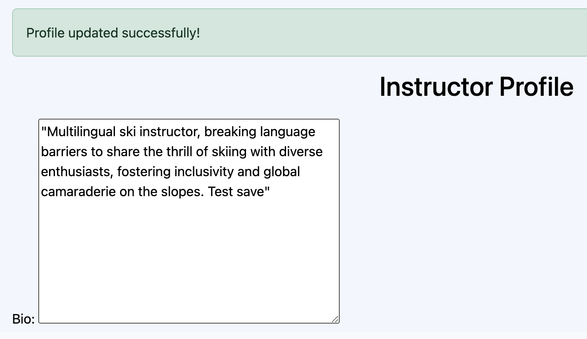

# [SKI SCHOOL PRO](https://ski-school-pro-2-4db020aae0bc.herokuapp.com)

The Ski School Pro (SKP) is a simple booking online project. It is based on a fictional small ski school that could be based anywhere in Europe! It is designed for instructors and customers alike. For the customers they can move around the site fluidly and see who the instructors are and book a ski lesson safely. For the instructors they can see which lessons they have, they also be able to alter their own bio’s. Please see the UX section for more details.

[](https://github.com/Stocks84/ski-school-pro/commits/main)
[](https://github.com/Stocks84/ski-school-pro/commits/main)
[](https://github.com/Stocks84/ski-school-pro)


source: [amiresponsive](https://ui.dev/amiresponsive?url=https://ski-school-pro-2-4db020aae0bc.herokuapp.com)

## UX

For the SKP design I had to consider the USER’S needs:
-	Website to be simple,
-	Easily fluid to get around the site,
-	Keep their data secure,
-	Option for the owner to have an administration section private only for the owner,
-	Implement CRUD design features & where needed defensive programming.


### Colour Scheme

With the colour scheme I used a combination of soft greys and blues to enhance the feeling of the cool winter season.

### Typography

I used the default Font from Bootstraps, as it stands out quite nicely. (Subject to change due time constrictions). I used the Font Awesome icons for the social media icons and altered the colours to reflect the colour scheme throughout the site. 

- [Font Awesome](https://fontawesome.com) icons were used throughout the site, such as the social media icons in the footer.

## User Stories


### Ski Instructor

-	As a ski school instructor, I can be able to view my teaching schedule and see details of upcoming lessons, including student information and skill levels so that I am able to cater to my client.

### Student

-	As a ski school student, I can be able to book a lesson by providing my personal details and preferences so that so that I can get the lesson I need.
-	As a ski school student, I can be able to browse available lessons and view details so that I can make informed decision.
-	As a ski school student, I can be able to view my upcoming lessons and any relevant information, or updates related to them. Additionally, I want to have the ability to cancel my appointment if needed so that I can have some flexibility

### Site Admin

-	As a ski school administrator, I can be able to manage lesson availability, including adding new lessons, modifying existing ones, and cancelling lessons if necessary so that have a overview on what is going on in the ski school

## Wireframes

To follow best practice, wireframes were developed for desktop sizes.
I've used [Balsamiq](https://balsamiq.com/wireframes) to design my site wireframes.

### Desktop Wireframes

Home
  - 


## Features

### Existing Features

- **Social Icons-#1**

    - Once clicked on opens a new window for the user to visit SKP social media sites which improves interactivity and promotion.


- **User Registration-#2**

    - The user is allowed to register so that they can eventually be able to login and potentially book a lesson and access membership areas of the website.


- **Registration Successful-#3**

    - Gives the User acknowledgement that their registration was a success. Allows them to proceed to login.


- **Restricted Access to Lesson or Booking Page-#4/5**

    - If the User is not logged on that User can not view the lessons or Booking page and is invited to register and then login.


- **Welcome Back-#6**

    - The user is given a welcome back message to confirm the success of the login. Also for added clarity their user name is now in the navigation bar in the top right corner and a logout button has been introduced.


- **Restricted access to the instructor Bio’s-#7**

    - If a non-instructor manages to gain access to the instructor/profile page a message will appear on the redirected home page and ask them to book a lesson instead.


- **Access to lesson list-#8**

    - Now the user has access to the lesson list, and see what lessons are available to them and with instructor.


- **Access to booking form-#9**

    - The user can now select a lesson from the dropdown menu. Also, they are required to put their username to complete the booking.


- **Booking confirmation-#10**

    - Once a lesson is submitted the User is redirected to the home page with a message confirming their booking.


- **Access to lesson list-#11**

    - In the navbar in the Top right-hand corner there is a search ski instructor that will only display instructors. Once selected will take the user to the instructor bio.


- **Access to booking form-#12**

    - The website works on a mobile/tablet device and the navigation bar transforms into a drop-down menu for convenience.


- **Instructor Profile-#13**

    - The instructor can update their ‘bio’ or if they no longer want to be part of the ski school have the option of deleting their whole profile.


- **Change Bio-#14**

    - Once bio is updated a success message is supplied to confirm the changes. 



- **Delete Bio-#15**

    - The instructor can delete their whole profile as well but using defensive programming a message pops asking the instructor if they are sure they want to delete their profile.


### Future Features

- Add individual pages for the instructors-#1
    - So that the instructors have a page for their profile where they can upload a picture of themselves.
- Add a comments page on the instructor’s bios-#2
    - Allow students to give reviews and respond how they found their lesson.
- Edit booking-#3
    - Allow the student to edit or even delete the lesson they had booked.
- Allow students to delete their data-#4
    - So that the student does not have to go through admin.
- Add in depth profiles for students-#5
    - So, they can add their ability, languages, age etc.
- More in-depth lesson list-#6
    - Actions menu on the side so the student can see if they can join the lesson or edit their lesson.

## Tools & Technologies Used

- [](https://gitpod.io) used as a cloud-based IDE for development.
- [](https://en.wikipedia.org/wiki/CSS) used for the main site design and layout.
- [](https://www.javascript.com) used for user interaction on the site.
- [](https://www.python.org) used as the back-end programming language.
- [](https://www.heroku.com) used for hosting the deployed back-end site.
- [](https://getbootstrap.com) used as the front-end CSS framework for modern responsiveness and pre-built components.
- [](https://www.djangoproject.com) used as the Python framework for the site.
- [](https://www.postgresql.org) used as the relational database management.
- [](https://www.elephantsql.com) used as the Postgres database.
- [](https://cloudinary.com) used for online static file storage.
- [](https://whitenoise.readthedocs.io) used for serving static files with Heroku.
- [](https://aws.amazon.com/s3) used for online static file storage.
- [](https://balsamiq.com/wireframes) used for creating wireframes.
- [](https://fontawesome.com) used for the icons.


## Database Design


## Agile Development Process

### GitHub Projects

[GitHub Projects](https://github.com/Stocks84/ski-school-pro/projects) served as an Agile tool for this project.
It isn't a specialized tool, but with the right tags and project creation/issue assignments, it can be made to work.

Through it, user stories, issues, and milestone tasks were planned, then tracked on a weekly basis using the basic Kanban board.


### GitHub Issues

[GitHub Issues](https://github.com/Stocks84/ski-school-pro/issues) served as an another Agile tool.
There, I used my own **User Story Template** to manage user stories.

It also helped with milestone iterations on a weekly basis.

- [Open Issues](https://github.com/Stocks84/ski-school-pro/issues) [](https://github.com/Stocks84/ski-school-pro/issues)

   

- [Closed Issues](https://github.com/Stocks84/ski-school-pro/issues?q=is%3Aissue+is%3Aclosed) [](https://github.com/Stocks84/ski-school-pro/issues?q=is%3Aissue+is%3Aclosed)


## Testing

> [!NOTE]  
> For all testing, please refer to the [TESTING.md](TESTING.md) file.

## Deployment

The live deployed application can be found deployed on [Heroku](https://ski-school-pro-2-4db020aae0bc.herokuapp.com).

### Cloudinary API

This project uses the [Cloudinary API](https://cloudinary.com) to store media assets online, due to the fact that Heroku doesn't persist this type of data.

To obtain your own Cloudinary API key, create an account and log in.

- For *Primary interest*, you can choose *Programmable Media for image and video API*.
- Optional: *edit your assigned cloud name to something more memorable*.
- On your Cloudinary Dashboard, you can copy your **API Environment Variable**.
- Be sure to remove the `CLOUDINARY_URL=` as part of the API **value**; this is the **key**.

### Heroku Deployment

This project uses [Heroku](https://www.heroku.com), a platform as a service (PaaS) that enables developers to build, run, and operate applications entirely in the cloud.

Deployment steps are as follows, after account setup:

- Select **New** in the top-right corner of your Heroku Dashboard, and select **Create new app** from the dropdown menu.
- Your app name must be unique, and then choose a region closest to you (EU or USA), and finally, select **Create App**.
- From the new app **Settings**, click **Reveal Config Vars**, and set your environment variables.

> [!IMPORTANT]  
> This is a sample only; you would replace the values with your own if cloning/forking my repository.

| Key | Value |
| --- | --- |
| `CLOUDINARY_URL` | user's own value |
| `DATABASE_URL` | user's own value |
| `DISABLE_COLLECTSTATIC` | 1 (*this is temporary, and can be removed for the final deployment*) |
| `SECRET_KEY` | user's own value |

Heroku needs three additional files in order to deploy properly.

- requirements.txt
- Procfile
- runtime.txt

You can install this project's **requirements** (where applicable) using:

- `pip3 install -r requirements.txt`

If you have your own packages that have been installed, then the requirements file needs updated using:

- `pip3 freeze --local > requirements.txt`

The **Procfile** can be created with the following command:

- `echo web: gunicorn app_name.wsgi > Procfile`
- *replace **app_name** with the name of your primary Django app name; the folder where settings.py is located*

The **runtime.txt** file needs to know which Python version you're using:
1. type: `python3 --version` in the terminal.
2. in the **runtime.txt** file, add your Python version:
    - `python-3.9.18`

For Heroku deployment, follow these steps to connect your own GitHub repository to the newly created app:

Either:

- Select **Automatic Deployment** from the Heroku app.

Or:

- In the Terminal/CLI, connect to Heroku using this command: `heroku login -i`
- Set the remote for Heroku: `heroku git:remote -a app_name` (replace *app_name* with your app name)
- After performing the standard Git `add`, `commit`, and `push` to GitHub, you can now type:
    - `git push heroku main`

The project should now be connected and deployed to Heroku!

### Local Deployment

This project can be cloned or forked in order to make a local copy on your own system.

For either method, you will need to install any applicable packages found within the *requirements.txt* file.

- `pip3 install -r requirements.txt`.

You will need to create a new file called `env.py` at the root-level,
and include the same environment variables listed above from the Heroku deployment steps.

> [!IMPORTANT]  
> This is a sample only; you would replace the values with your own if cloning/forking my repository.

Sample `env.py` file:

```python
import os

os.environ.setdefault("CLOUDINARY_URL", "user's own value")
os.environ.setdefault("DATABASE_URL", "user's own value")
os.environ.setdefault("SECRET_KEY", "user's own value")

# local environment only (do not include these in production/deployment!)
os.environ.setdefault("DEBUG", "True")
```

Once the project is cloned or forked, in order to run it locally, you'll need to follow these steps:

- Start the Django app: `python3 manage.py runserver`
- Stop the app once it's loaded: `CTRL+C` or `⌘+C` (Mac)
- Make any necessary migrations: `python3 manage.py makemigrations`
- Migrate the data to the database: `python3 manage.py migrate`
- Create a superuser: `python3 manage.py createsuperuser`
- Load fixtures (if applicable): `python3 manage.py loaddata file-name.json` (repeat for each file)
- Everything should be ready now, so run the Django app again: `python3 manage.py runserver`

#### Cloning

You can clone the repository by following these steps:

1. Go to the [GitHub repository](https://github.com/Stocks84/ski-school-pro) 
2. Locate the Code button above the list of files and click it 
3. Select if you prefer to clone using HTTPS, SSH, or GitHub CLI and click the copy button to copy the URL to your clipboard
4. Open Git Bash or Terminal
5. Change the current working directory to the one where you want the cloned directory
6. In your IDE Terminal, type the following command to clone my repository:
    - `git clone https://github.com/Stocks84/ski-school-pro.git`
7. Press Enter to create your local clone.

Alternatively, if using Gitpod, you can click below to create your own workspace using this repository.

[](https://gitpod.io/#https://github.com/Stocks84/ski-school-pro)

Please note that in order to directly open the project in Gitpod, you need to have the browser extension installed.
A tutorial on how to do that can be found [here](https://www.gitpod.io/docs/configure/user-settings/browser-extension).

#### Forking

By forking the GitHub Repository, we make a copy of the original repository on our GitHub account to view and/or make changes without affecting the original owner's repository.
You can fork this repository by using the following steps:

1. Log in to GitHub and locate the [GitHub Repository](https://github.com/Stocks84/ski-school-pro)
2. At the top of the Repository (not top of page) just above the "Settings" Button on the menu, locate the "Fork" Button.
3. Once clicked, you should now have a copy of the original repository in your own GitHub account!

## Credits

### Content

| Source | Location | Notes |
| --- | --- | --- |
| [W3Schools](https://www.w3schools.com/howto/howto_js_topnav_responsive.asp) | entire site | responsive HTML/CSS/JS navbar |
| [W3Schools](https://www.w3schools.com/howto/howto_css_modals.asp) | contact page | interactive pop-up (modal) |
| [W3Schools](https://www.w3schools.com/css/css3_variables.asp) | entire site | how to use CSS :root variables |
| [Flexbox Froggy](https://flexboxfroggy.com/) | entire site | modern responsive layouts |
| [Grid Garden](https://cssgridgarden.com) | entire site | modern responsive layouts |
| [strftime](https://strftime.org) | CRUD functionality | helpful tool to format date/time from string |
| [WhiteNoise](http://whitenoise.evans.io) | entire site | hosting static files on Heroku temporarily |

### Media

| Source | Location | Type | Notes |
| --- | --- | --- | --- |
| [TinyPNG](https://tinypng.com) | entire site | image | tool for image compression |

### Acknowledgements

- I would like to thank my Code Institute mentor, [Tim Nelson](https://github.com/TravelTimN) for his support throughout the development of this project.
- I would like to thank my partner in crime Sanja who has helped keep me motivated during the house move, with my work, and preparing for the arrival of our new daughter.
- I would like to thank my friends for moral support
- I would like to mention as well that i loved doing this project and learned more than i could imagine. However i went through some issues where i had to start again on this project a few times hence i ran out of time and the CSS styling and some other ideas were not implemented. Like i said i have learned a lot about myself and coding.
