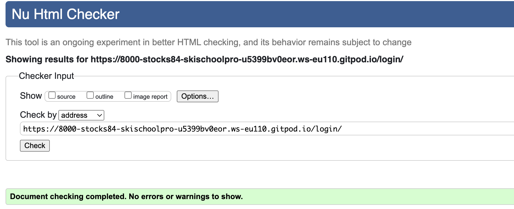
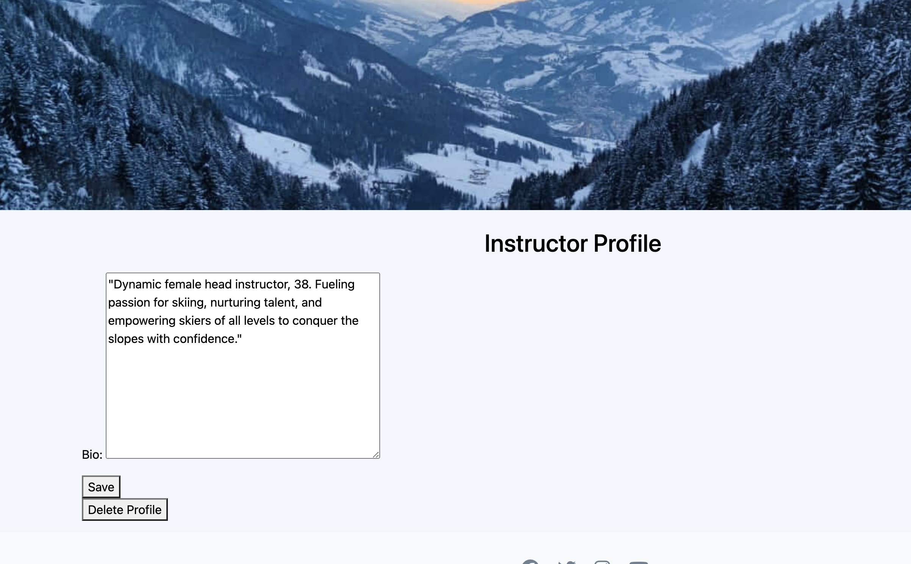
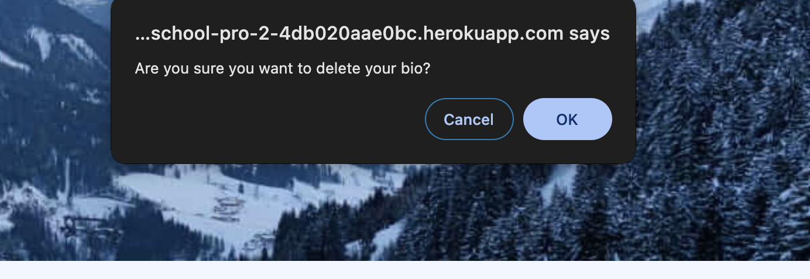

# Testing

> [!NOTE]  
> Return back to the [README.md](README.md) file.

## Code Validation

### HTML

I have used the recommended [HTML W3C Validator](https://validator.w3.org) to validate all of my HTML files.

| Directory | File | Screenshot | Notes |
| --- | --- | --- | --- |
| booking | booking_form.html |  | |
| booking | home.html |  | |
| booking | instructor_list.html |  | |
| booking | instructor_profile.html |  | |
| booking | lesson_list.html |  | |
| booking | login_form.html |  | |
| booking | registration_form.html |  | |

### CSS

I have used the recommended [CSS Jigsaw Validator](https://jigsaw.w3.org/css-validator) to validate all of my CSS files.

| Directory | File | Screenshot | Notes |
| --- | --- | --- | --- |
| static | styles.css |  | |

### JavaScript

I have used the recommended [JShint Validator](https://jshint.com) to validate all of my JS files.

| Directory | File | Screenshot | Notes |
| --- | --- | --- | --- |
| static | script.js |  | |

### Python

I have used the recommended [PEP8 CI Python Linter](https://pep8ci.herokuapp.com) to validate all of my Python files.

| Directory | File | CI URL | Screenshot | Notes |
| --- | --- | --- | --- | --- |
| booking | admin.py | [PEP8 CI](https://pep8ci.herokuapp.com/https://raw.githubusercontent.com/Stocks84/ski-school-pro/main/booking/admin.py) |  | |
| booking | context_processors.py | [PEP8 CI](https://pep8ci.herokuapp.com/https://raw.githubusercontent.com/Stocks84/ski-school-pro/main/booking/context_processors.py) |  | |
| booking | forms.py | [PEP8 CI](https://pep8ci.herokuapp.com/https://raw.githubusercontent.com/Stocks84/ski-school-pro/main/booking/forms.py) |  | |
| booking | models.py | [PEP8 CI](https://pep8ci.herokuapp.com/https://raw.githubusercontent.com/Stocks84/ski-school-pro/main/booking/models.py) |  | |
| booking | urls.py | [PEP8 CI](https://pep8ci.herokuapp.com/https://raw.githubusercontent.com/Stocks84/ski-school-pro/main/booking/urls.py) |  | |
| booking | views.py | [PEP8 CI](https://pep8ci.herokuapp.com/https://raw.githubusercontent.com/Stocks84/ski-school-pro/main/booking/views.py) |  | |
|  | manage.py | [PEP8 CI](https://pep8ci.herokuapp.com/https://raw.githubusercontent.com/Stocks84/ski-school-pro/main/manage.py) |  | |
| ski_school | settings.py | [PEP8 CI](https://pep8ci.herokuapp.com/https://raw.githubusercontent.com/Stocks84/ski-school-pro/main/ski_school/settings.py) |  | |
| ski_school | urls.py | [PEP8 CI](https://pep8ci.herokuapp.com/https://raw.githubusercontent.com/Stocks84/ski-school-pro/main/ski_school/urls.py) |  | |

## Browser Compatibility

I've tested my deployed project on multiple browsers to check for compatibility issues.

| Browser | Home | About | Contact | etc | Notes |
| --- | --- | --- | --- | --- | --- |
| Chrome |  | - | Works as expected |
| Firefox |  | - | Works as expected |
| Safari |  | - | Works as expected |

## Responsiveness

I've tested my deployed project on multiple devices to check for responsiveness issues.

| Device | Home | Notes |
| --- | --- | --- |
| Mobile (DevTools) |  | Works as expected |
| Tablet (DevTools) |  | Works as expected |
| Desktop |  | Works as expected |

## Lighthouse Audit

I've tested my deployed project using the Lighthouse Audit tool to check for any major issues.

| Page | Mobile | Desktop | Notes |
| --- | --- | --- | --- |
| Home |  |  | Some minor warnings |
| Instructors |  |  | Some minor warnings |

## Defensive Programming

Defensive programming was manually tested with the below user acceptance testing:

| Page | Expectation | Test | Result | Fix | Screenshot |
| --- | --- | --- | --- | --- | --- |
| All Pages | | | | | |
| | Social Icons in the footer is expected to open a new window to the social media site when the user clicks on the icon | Tested the feature by clicking the icons | The feature behaved as expected. | Test concluded and passed |  |
| | Navigation bars is expected to have line appear underneath when the cursor hovers and then take the user to the designated page on the site when the user clicks on the page they want | Tested the feature by hovering the cursor and then clicking on the links | The feature worked as expected | Test concluded and passed |  |
| | Search bar is expected to have a list of instructors and once chosen click search to head to the bio page | Tested the feature by using the drop down menu and then clicking search | The feature worked as expected | Test concluded and passed |  |
| Lessons page & Booking page without login | | | | | |
| | User login screen is expected to appear and restrict the user from accessing the page when the user tries to view the page without logging in | Tested the feature by trying to access the page without a logging in | The feature behaved as expected | Test concluded and passed |  |
| Register page | | | | | |
| | Register for login is expected to redirect to the home page with a success confirmation message when the user puts all the correct information into the fields | Tested the feature by doing registering the correct details | The feature behaved as expected | Test concluded and passed |  |
| | If the required field is missing or not filled in correctly it is expected to come up with a message to fill or enter the correct information when the user does not fill the required fields properly | Tested the feature by entering the wrong data | The feature behaved as expected | Test concluded and passed |  |
| Login page | | | | | |
| | Login is expected to redirect to the home page with a welcome back message when the user logins correctly | Tested the feature by logging in as a student | The feature behaved as expected | Test concluded and passed |  |
| Instructor profile page | | | | | |
| | Restricted access for student is expected to redirect to the home page with a ‘you are not allowed access’ message when the user puts the correct url in| Tested the feature by putting the private url in, signed in as a student | The feature behaved as expected | Test concluded and passed |  |
| | Gain access as Instructor & be able to edit or delete their profile by logging in with the correct instructor log in | Tested the feature by entering the correct instructor log in| The feature behaved as expected | Test concluded and passed |  |
| | Instructor allowed to edit their bio is expected to have a success message when the instructor saves the new edit | Tested the feature by saving the edited bio | The feature behaved as expected | Test concluded and passed |  |
| | Delete profile is expected to have alert message pop up to confirm in the instructor want to delete the profile when they click the delete button | Tested the feature by putting the private url in, singed in as a student | The feature behaved as expected | Test concluded and passed |  |
